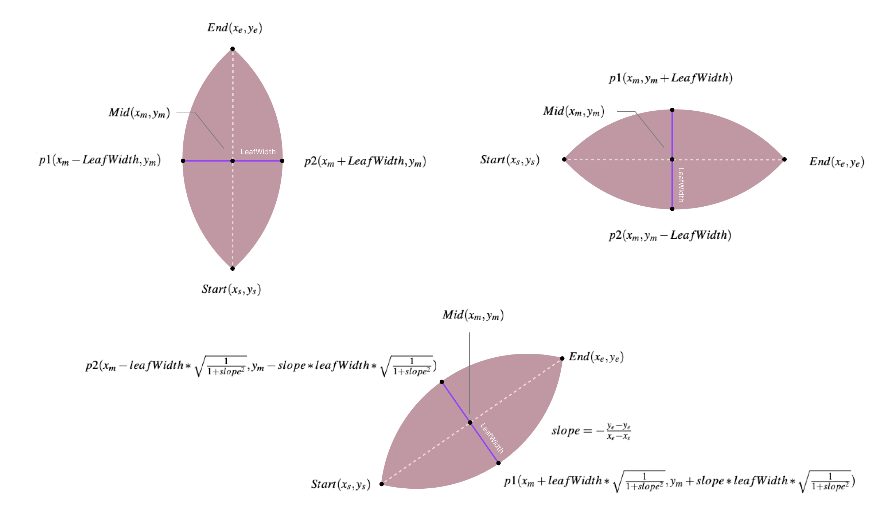

# Mentor Trees

Check out our sick website! [mentortrees.com](https://www.mentortrees.com/)

- [Mentor Trees](#mentor-trees)
	- [Introduction](#introduction)
	- [Tech Stack](#tech-stack)
	- [Data Source](#data-source)
	- [Installation](#installation)
	- [Design Doc](#design-doc)
		- [Preprocessor](#preprocessor)
		- [Tree Implementation](#tree-implementation)
	- [Acknowledgment](#acknowledgment)

## Introduction
Submission for the 2022 IEEE VISAP. 

Topics: `Storytelling`, `Gender Equity`,`Gender in Academia`. 

I am responsible for the tree visualization :)

## Tech Stack
* Frontend: P5.js
* Backend: Express, Docker

## Data Source
* From https://github.com/JialingJia/scimap-FA-2021/tree/main/mentorship/data/tree%20candidate by [Houjiang Liu](https://github.com/JialingJia).

## Installation
If you use NPM, you can 

`git clone` this repo -> `npm install` -> `npm start` -> `Listening to PORT 5000`

Else if you use Docker, you can 

Go to `Dockerfile` -> use `FROM node:16-alpine` instead of the linux one -> build the docker image `docker build . -t mentor-tree` -> run the image inside a container called "mentor-tree" `docker run -p 5000:5000 --name mentor-tree mentor-tree` -> stop running `docker stop mentor-tree`

## Design Doc

### Preprocessor

- **Objectives**: 
	1. Map `children_num` to `weight` for each researcher.
	2. Apply new `gender_color`.
- **File**: `preprocessor.js`

- **Steps**
	1. Use a recursive function to traverse all the researchers. When traversing a researcher ->
		1. Assign him/she/unknown a new `gender_color`.
		2. Add his/her/unknown's `research_area` to a **SET**.
		3. Store the `researcher_name` and his/her/unknown's `children_num` to a **MAP**.

2. Calculate the `weight` of each researcher 

	```
	sum = sum up all children_num in the MAP
	max = maximum children number in the MAP
	min = minimum children number in the MAP
	range_mean = (max - min) / 2
	```

3. Oversampling / Undersampling

	If we plot each researcher using their **original** `weight` without doing oversampling / undersampling.

	The proportion of the tree will be extremely imbalanced and weird. 

	To avoid this situation, we need to perform oversampling / undersampling on each researcher's `children_num`.

	```
	weight = w
	children_num = cn
	range_mean = rm
	i = random researcher i
	```

	```
	|- Original Weight

		w_i = cn_i / sum

	|- New Weight

		w_i = 	[cn_i - |cn_i - rm| * 0.1] / sum , (cn_i > rm)

			cn_i / sum 			 , (cn_i = rm)

			[cn_i + |cn_i - rm| * 0.1] / sum , (cn_i < rm) 

	``` 

### Tree Implementation

- **Objectives**: Just plot the tree in **p5**

- **File**: `tree.js` 

- **Steps**

	1. Use the HSB color system to assign each `research_area` a unique hue value.

	2. Use a recursive function to traverse all the researchers, when traversing a researcher ->
		1. Draw his/her/unknown `research_area` (just a dot)
		2. Draw the leaf using the following equation (easy peasy)

			
		3. If it's a her -> tilte right, him -> tilte left, unknow -> none tilte

			
## Acknowledgment
[Jiabao Li](https://github.com/jiabaoli), [Houjiang Liu](https://github.com/JialingJia), [Alec McGail](https://github.com/amcgail), [Di Wu](#acknowledgment), [Ying Ding](#acknowledgment)
